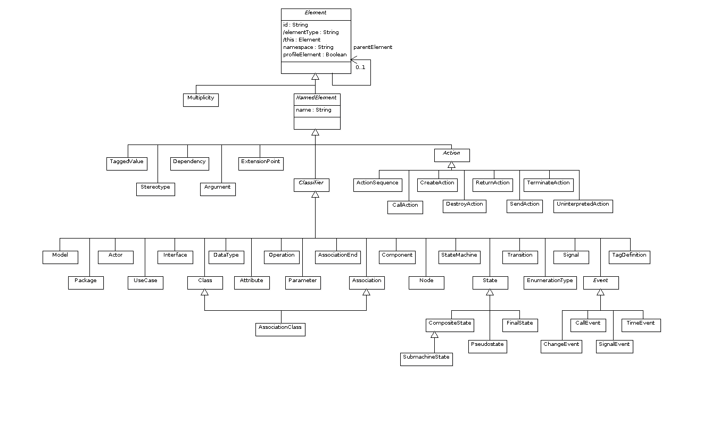
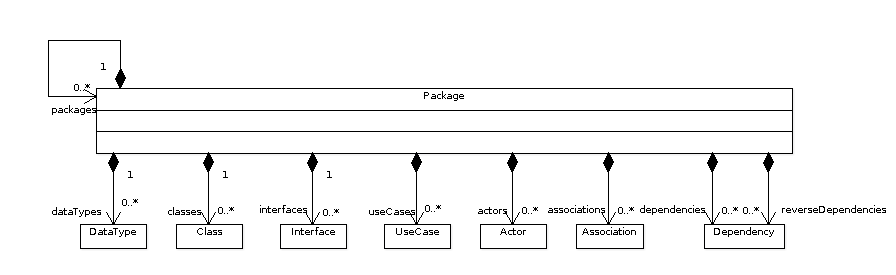
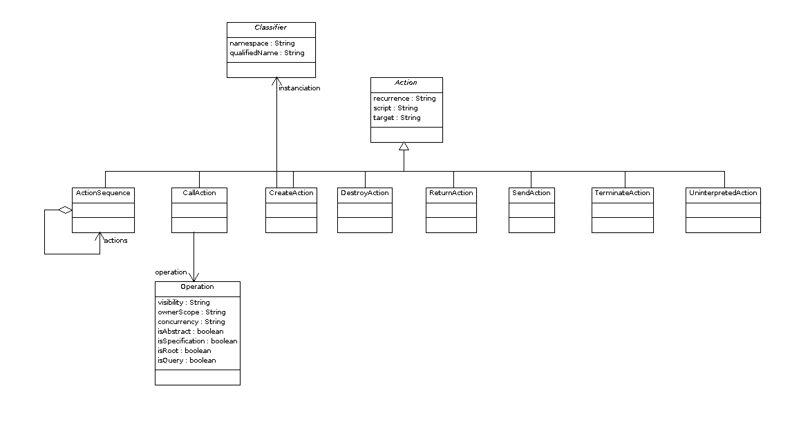

ModelRepository Meta Model
==========================
This is description of the meta model of the model repository.

Class Hierarchy
---------------

Element
-------

Package
-------

Class
-----

State Machine
-------------

Actions
-------

Events
------

UseCases
--------

Deployment
----------

